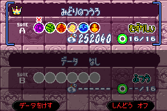
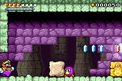

[English](README.md)/[日本語](README-ja.md)

# ワリオランドアドバンス～ジャングル・ランブル

もし『ワリオランドアドバンス ヨーキのお宝』のファンなら、新たな没入感を得られることで、お宝探しがさらに盛り上がること間違いなしです。「ジャングル・ランブル」パッチは、ゲームボーイアドバンス（GBA）の名作に総合的な振動（ランブル）機能を追加し、さまざまなゲーム内アクションやイベントに合わせた触覚フィードバックを提供します。

## ゲームボーイプレイヤー対応
ゲームキューブで遊ぶ場合も、このパッチにより希少な「ゲームボーイプレイヤー振動機能」が追加され、ゲームキューブコントローラで操作すると『ワリオランドアドバンス ヨーキのお宝』が振動します。これは公式にリリースされたGBAタイトルに対して、初めてホームブリューのパッチでこの機能を実装した例となります。

## 対応プラットフォーム
このパッチは、以下を含む多くの実機やエミュレータと互換性があります:

- ゲームボーイアドバンス
  - EZ-FLASH Omega Definitive Edition フラッシュカート
  - insideGadgets 32MB 256Kbit FRAM ランブルフラッシュカート
- ゲームキューブ（ゲームボーイプレイヤー搭載）
- MiSTer ハードウェアエミュレータ
- Analogue Pocket
  - 上記のランブル対応フラッシュカート（※対応機種参照）を使用
  - openFPGA-GBAコア + DS振動カートリッジ※
- mGBA エミュレータ

## ダウンロード
さあ、欲望まみれにパッチを手に入れてしまいましょう。リリースセクションからダウンロードできます。ワリオならきっと利益の分け前を要求するところですが、ありがたいことにこのパッチは無料です。質問やフィードバックがあれば、ぜひ関連ディスカッションセクションでシェアしてください。ROMhacking.netでの旧レビューは、[REVIEWS.md](REVIEWS.md) にまとめてあります。

## 使い方
[Lunar IPS](https://fusoya.eludevisibility.org/lips/) や [ROM Patcher JS](https://www.marcrobledo.com/RomPatcher.js/) などのIPSパッチ適用ツールを使用し、USA版・Europe版もしくはJapan版のクリーンな『ワリオランドアドバンス ヨーキのお宝』ROM（CRC32が `D6141609` または `F56EBB7A` のもの）に対して、`wl4-rumble_x.x.x.ips` を適用してください。

※注: openFPGA-GBAコアを使用する場合は、通常のパッチを当てた後、ランブルを有効にするための[追加パッチ](addendum)を適用する必要があります。使用するROMの地域に合わせ、以下のどちらかを選んでください。

- USA・Europe向け: `AWAE-V49E_hackfix.ips`  
- Japan向け: `AWAJ-V49J_hackfix.ips`

## スクリーンショット

  
