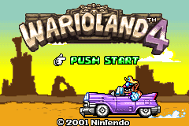
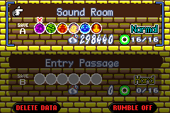

[English](README.md)/[日本語](README-ja.md)

# Wario Land 4: Jungle Rumble!

If you’re a Wario Land 4 fan, get ready to bump up your treasure hunting experience to a new level of immersion. The "Jungle Rumble!" patch brings comprehensive rumble support to the original Game Boy Advance classic, by providing tactile feedback for many in-game actions and events.

## Game Boy Player Compatibility

Playing on a GameCube? This patch also adds the rare Game Boy Player rumble feature, making Wario Land 4 rumble when played with a GameCube controller. It is the _first-ever_ homebrew patch to add this feature to an officially released Game Boy Advance title.

## Supported Platforms

This patch is compatible with most hardware and emulators, including:  

- Game Boy Advance
  - EZ-FLASH Omega Definitive Edition flashcart
  - insideGadgets 32MB 256Kbit FRAM rumble flashcart
- GameCube with Game Boy Player
- MiSTer hardware emulators
- Analogue Pocket
  - with rumble-compatible flashcarts (see above)
  - openFPGA-GBA core + Nintendo DS Rumble Pak*
- mGBA emulator

## Download

Let's get greedy and grab the patch from the [releases](https://github.com/djedditt/wl4-rumble/releases/latest) section. Wario would probably demand a cut of the profits, but thankfully this patch is free. If you have questions or feedback, feel free to share your thoughts in the relevant [discussions](https://github.com/djedditt/wl4-rumble/discussions) section. Legacy reviews from ROMhacking.net can be found in [REVIEWS.md](REVIEWS.md)

## Usage
Use an IPS patcher tool like [Lunar IPS](https://fusoya.eludevisibility.org/lips/) or [Rom Patcher JS](https://www.marcrobledo.com/RomPatcher.js/) to apply the `wl4-rumble_x.x.x.ips` patch to either a USA, Europe or Japan version of a clean Wario Land 4 ROM (valid CRC32s are `D6141609` and `F56EBB7A`).

_*openFPGA-GBA core users have to apply an [additional patch](addendum) after using the regular patch to enable rumble. Use the hackfix patch that matches the region of your ROM._

- `AWAE-V49E_hackfix.ips` (USA, Europe)
- `AWAJ-V49J_hackfix.ips` (Japan)

## Screenshots

  
